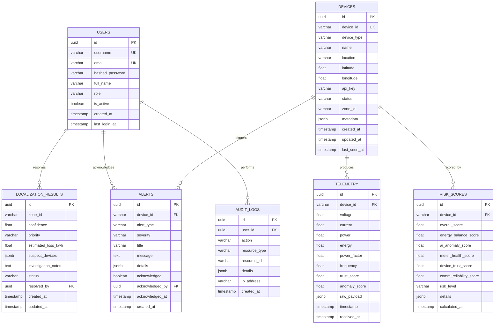

# KAVACHGRID 3.0 — Database Documentation

## Overview

KAVACHGRID 3.0 uses **PostgreSQL 15** as its primary data store. The schema is designed for:
- **High-frequency telemetry ingestion** (~1 record per device every 5 seconds)
- **Time-series queries** with indexed timestamps
- **Audit compliance** with full action logging
- **Investigation workflows** with stateful localization records

---

## ER Diagram



---

## Table Descriptions

### 1. `users` — Dashboard Users

Stores utility operators, investigators, and admins who access the dashboard.

| Column | Type | Constraints | Description |
|--------|------|-------------|-------------|
| `id` | UUID | PK, default gen | Unique identifier |
| `username` | VARCHAR(50) | UNIQUE, NOT NULL | Login username |
| `email` | VARCHAR(255) | UNIQUE, NOT NULL | Email address |
| `hashed_password` | VARCHAR(255) | NOT NULL | Bcrypt-hashed password |
| `full_name` | VARCHAR(100) | NOT NULL | Display name |
| `role` | VARCHAR(20) | NOT NULL | `admin`, `operator`, `investigator`, `viewer` |
| `is_active` | BOOLEAN | DEFAULT TRUE | Account active flag |
| `created_at` | TIMESTAMPTZ | DEFAULT NOW() | Account creation time |
| `last_login_at` | TIMESTAMPTZ | NULLABLE | Last login timestamp |

**Design Decision:** Roles are stored as VARCHAR instead of a separate roles table — simpler for a prototype with only 4 fixed roles.

---

### 2. `devices` — Registered IoT Nodes

Registry of all ESP32 nodes in the grid.

| Column | Type | Constraints | Description |
|--------|------|-------------|-------------|
| `id` | UUID | PK | Unique identifier |
| `device_id` | VARCHAR(50) | UNIQUE, NOT NULL | Human-readable ID (e.g., `FEEDER-01`, `CONSUMER-H1`) |
| `device_type` | VARCHAR(20) | NOT NULL | `feeder`, `consumer`, `localization` |
| `name` | VARCHAR(100) | NOT NULL | Descriptive name |
| `location` | VARCHAR(255) | NULLABLE | Physical location description |
| `latitude` | FLOAT | NULLABLE | GPS latitude for GIS map |
| `longitude` | FLOAT | NULLABLE | GPS longitude for GIS map |
| `api_key` | VARCHAR(255) | NOT NULL | Device authentication key |
| `status` | VARCHAR(20) | DEFAULT 'offline' | `online`, `offline`, `warning` |
| `zone_id` | VARCHAR(50) | NULLABLE | Localization zone grouping |
| `metadata` | JSONB | NULLABLE | Flexible device metadata |
| `created_at` | TIMESTAMPTZ | DEFAULT NOW() | Registration time |
| `updated_at` | TIMESTAMPTZ | DEFAULT NOW() | Last update time |
| `last_seen_at` | TIMESTAMPTZ | NULLABLE | Last telemetry received |

**Design Decision:** `zone_id` enables grouping devices by physical zones for the Progressive Localization Engine (Phase 11). `metadata` JSONB allows storing hardware-specific info without schema changes.

---

### 3. `telemetry` — Sensor Readings (High-Volume)

Time-series sensor data from all devices. **Highest-volume table** in the system.

| Column | Type | Constraints | Description |
|--------|------|-------------|-------------|
| `id` | UUID | PK | Unique identifier |
| `device_id` | VARCHAR(50) | FK → devices, NOT NULL | Source device |
| `voltage` | FLOAT | NOT NULL | Voltage reading (V) |
| `current` | FLOAT | NOT NULL | Current reading (A) |
| `power` | FLOAT | NOT NULL | Power reading (W) |
| `energy` | FLOAT | NOT NULL | Cumulative energy (Wh) |
| `power_factor` | FLOAT | NULLABLE | Power factor (0-1) |
| `frequency` | FLOAT | NULLABLE | Grid frequency (Hz) |
| `trust_score` | FLOAT | NULLABLE | Device Trust Engine score (0-100) |
| `anomaly_score` | FLOAT | NULLABLE | AI Anomaly Engine score (0-1) |
| `raw_payload` | JSONB | NULLABLE | Original MQTT JSON payload |
| `timestamp` | TIMESTAMPTZ | NOT NULL | Sensor measurement time |
| `received_at` | TIMESTAMPTZ | DEFAULT NOW() | Server receive time |

**Indexes:**
- `idx_telemetry_device_time` on `(device_id, timestamp DESC)` — fast per-device time queries
- `idx_telemetry_timestamp` on `(timestamp DESC)` — fast global time queries

**Design Decision:** We store both `timestamp` (device clock) and `received_at` (server clock) to detect clock drift. `trust_score` and `anomaly_score` are denormalized here for query efficiency — avoids JOINing with separate score tables for every dashboard refresh.

---

### 4. `alerts` — System Alerts

Generated by all 6 analytics engines.

| Column | Type | Constraints | Description |
|--------|------|-------------|-------------|
| `id` | UUID | PK | Unique identifier |
| `device_id` | VARCHAR(50) | FK → devices, NULLABLE | Related device (null for system alerts) |
| `alert_type` | VARCHAR(30) | NOT NULL | `energy_imbalance`, `anomaly`, `meter_health`, `device_trust`, `communication`, `localization` |
| `severity` | VARCHAR(10) | NOT NULL | `low`, `medium`, `high`, `critical` |
| `title` | VARCHAR(200) | NOT NULL | Short alert title |
| `message` | TEXT | NOT NULL | Detailed description |
| `details` | JSONB | NULLABLE | Structured alert data (scores, thresholds, etc.) |
| `acknowledged` | BOOLEAN | DEFAULT FALSE | Has operator acknowledged |
| `acknowledged_by` | UUID | FK → users, NULLABLE | Who acknowledged |
| `acknowledged_at` | TIMESTAMPTZ | NULLABLE | When acknowledged |
| `created_at` | TIMESTAMPTZ | DEFAULT NOW() | Alert generation time |

**Indexes:**
- `idx_alerts_device` on `(device_id, created_at DESC)`
- `idx_alerts_unacked` on `(acknowledged, severity)` — fast unacknowledged alert queries

---

### 5. `risk_scores` — Composite Risk Scores

Snapshot of the KAVACH Risk Engine output per device per scoring cycle.

| Column | Type | Constraints | Description |
|--------|------|-------------|-------------|
| `id` | UUID | PK | Unique identifier |
| `device_id` | VARCHAR(50) | FK → devices, NOT NULL | Scored device |
| `overall_score` | FLOAT | NOT NULL | Composite risk (0-100) |
| `energy_balance_score` | FLOAT | NOT NULL | Energy imbalance component (0-100) |
| `ai_anomaly_score` | FLOAT | NOT NULL | AI anomaly component (0-1, normalized) |
| `meter_health_score` | FLOAT | NOT NULL | Meter health component (0-100) |
| `device_trust_score` | FLOAT | NOT NULL | Device trust component (0-100) |
| `comm_reliability_score` | FLOAT | NOT NULL | Communication reliability (0-100) |
| `risk_level` | VARCHAR(10) | NOT NULL | `low`, `medium`, `high`, `critical` |
| `details` | JSONB | NULLABLE | Detailed scoring breakdown |
| `calculated_at` | TIMESTAMPTZ | DEFAULT NOW() | Score calculation time |

**Indexes:**
- `idx_risk_device_time` on `(device_id, calculated_at DESC)`
- `idx_risk_level` on `(risk_level, overall_score DESC)` — rank high-risk consumers

**Design Decision:** Storing individual component scores alongside the composite enables the dashboard to show the "why" behind each risk score — critical for an *investigation support* system.

---

### 6. `localization_results` — Progressive Localization

Investigation records for narrowing suspicious areas.

| Column | Type | Constraints | Description |
|--------|------|-------------|-------------|
| `id` | UUID | PK | Unique identifier |
| `zone_id` | VARCHAR(50) | NOT NULL | Physical zone identifier |
| `confidence` | FLOAT | NOT NULL | Localization confidence (0-1) |
| `priority` | VARCHAR(10) | NOT NULL | Investigation priority: `low`, `medium`, `high`, `critical` |
| `estimated_loss_kwh` | FLOAT | NULLABLE | Estimated energy loss in zone |
| `suspect_devices` | JSONB | NOT NULL | Array of `{device_id, score, reason}` objects |
| `investigation_notes` | TEXT | NULLABLE | Operator notes |
| `status` | VARCHAR(20) | DEFAULT 'pending' | `pending`, `investigating`, `resolved`, `false_alarm` |
| `resolved_by` | UUID | FK → users, NULLABLE | Investigator who resolved |
| `created_at` | TIMESTAMPTZ | DEFAULT NOW() | Record creation time |
| `updated_at` | TIMESTAMPTZ | DEFAULT NOW() | Last update time |

**Design Decision:** `suspect_devices` is JSONB instead of a junction table — keeps the schema simple and allows storing per-device context (score, reason) directly.

---

### 7. `audit_logs` — System Audit Trail

Immutable log of all significant system actions.

| Column | Type | Constraints | Description |
|--------|------|-------------|-------------|
| `id` | UUID | PK | Unique identifier |
| `user_id` | UUID | FK → users, NULLABLE | Who (null for system actions) |
| `action` | VARCHAR(50) | NOT NULL | e.g., `alert_acknowledged`, `device_registered`, `risk_calculated` |
| `resource_type` | VARCHAR(30) | NOT NULL | e.g., `alert`, `device`, `risk_score`, `localization` |
| `resource_id` | VARCHAR(50) | NULLABLE | ID of affected resource |
| `details` | JSONB | NULLABLE | Action details |
| `ip_address` | VARCHAR(45) | NULLABLE | Client IP address |
| `created_at` | TIMESTAMPTZ | DEFAULT NOW() | Action timestamp |

**Index:**
- `idx_audit_user` on `(user_id, created_at DESC)`
- `idx_audit_resource` on `(resource_type, resource_id)`

**Design Decision:** Audit logs are append-only (no UPDATE/DELETE) — ensures tamper-proof audit trail for compliance.

---

## Raw SQL Schema

```sql
-- ============================================
-- KAVACHGRID 3.0 — Database Schema
-- PostgreSQL 15
-- ============================================

-- Enable UUID generation
CREATE EXTENSION IF NOT EXISTS "uuid-ossp";

-- 1. Users
CREATE TABLE users (
    id              UUID PRIMARY KEY DEFAULT uuid_generate_v4(),
    username        VARCHAR(50) UNIQUE NOT NULL,
    email           VARCHAR(255) UNIQUE NOT NULL,
    hashed_password VARCHAR(255) NOT NULL,
    full_name       VARCHAR(100) NOT NULL,
    role            VARCHAR(20) NOT NULL DEFAULT 'viewer'
                    CHECK (role IN ('admin', 'operator', 'investigator', 'viewer')),
    is_active       BOOLEAN NOT NULL DEFAULT TRUE,
    created_at      TIMESTAMPTZ NOT NULL DEFAULT NOW(),
    last_login_at   TIMESTAMPTZ
);

-- 2. Devices
CREATE TABLE devices (
    id              UUID PRIMARY KEY DEFAULT uuid_generate_v4(),
    device_id       VARCHAR(50) UNIQUE NOT NULL,
    device_type     VARCHAR(20) NOT NULL
                    CHECK (device_type IN ('feeder', 'consumer', 'localization')),
    name            VARCHAR(100) NOT NULL,
    location        VARCHAR(255),
    latitude        DOUBLE PRECISION,
    longitude       DOUBLE PRECISION,
    api_key         VARCHAR(255) NOT NULL,
    status          VARCHAR(20) NOT NULL DEFAULT 'offline'
                    CHECK (status IN ('online', 'offline', 'warning')),
    zone_id         VARCHAR(50),
    metadata        JSONB,
    created_at      TIMESTAMPTZ NOT NULL DEFAULT NOW(),
    updated_at      TIMESTAMPTZ NOT NULL DEFAULT NOW(),
    last_seen_at    TIMESTAMPTZ
);

-- 3. Telemetry (high-volume)
CREATE TABLE telemetry (
    id              UUID PRIMARY KEY DEFAULT uuid_generate_v4(),
    device_id       VARCHAR(50) NOT NULL REFERENCES devices(device_id) ON DELETE CASCADE,
    voltage         DOUBLE PRECISION NOT NULL,
    current         DOUBLE PRECISION NOT NULL,
    power           DOUBLE PRECISION NOT NULL,
    energy          DOUBLE PRECISION NOT NULL,
    power_factor    DOUBLE PRECISION,
    frequency       DOUBLE PRECISION,
    trust_score     DOUBLE PRECISION,
    anomaly_score   DOUBLE PRECISION,
    raw_payload     JSONB,
    timestamp       TIMESTAMPTZ NOT NULL,
    received_at     TIMESTAMPTZ NOT NULL DEFAULT NOW()
);

CREATE INDEX idx_telemetry_device_time ON telemetry (device_id, timestamp DESC);
CREATE INDEX idx_telemetry_timestamp ON telemetry (timestamp DESC);

-- 4. Alerts
CREATE TABLE alerts (
    id              UUID PRIMARY KEY DEFAULT uuid_generate_v4(),
    device_id       VARCHAR(50) REFERENCES devices(device_id) ON DELETE SET NULL,
    alert_type      VARCHAR(30) NOT NULL
                    CHECK (alert_type IN ('energy_imbalance', 'anomaly', 'meter_health',
                                          'device_trust', 'communication', 'localization')),
    severity        VARCHAR(10) NOT NULL
                    CHECK (severity IN ('low', 'medium', 'high', 'critical')),
    title           VARCHAR(200) NOT NULL,
    message         TEXT NOT NULL,
    details         JSONB,
    acknowledged    BOOLEAN NOT NULL DEFAULT FALSE,
    acknowledged_by UUID REFERENCES users(id) ON DELETE SET NULL,
    acknowledged_at TIMESTAMPTZ,
    created_at      TIMESTAMPTZ NOT NULL DEFAULT NOW()
);

CREATE INDEX idx_alerts_device ON alerts (device_id, created_at DESC);
CREATE INDEX idx_alerts_unacked ON alerts (acknowledged, severity);

-- 5. Risk Scores
CREATE TABLE risk_scores (
    id                      UUID PRIMARY KEY DEFAULT uuid_generate_v4(),
    device_id               VARCHAR(50) NOT NULL REFERENCES devices(device_id) ON DELETE CASCADE,
    overall_score           DOUBLE PRECISION NOT NULL,
    energy_balance_score    DOUBLE PRECISION NOT NULL,
    ai_anomaly_score        DOUBLE PRECISION NOT NULL,
    meter_health_score      DOUBLE PRECISION NOT NULL,
    device_trust_score      DOUBLE PRECISION NOT NULL,
    comm_reliability_score  DOUBLE PRECISION NOT NULL,
    risk_level              VARCHAR(10) NOT NULL
                            CHECK (risk_level IN ('low', 'medium', 'high', 'critical')),
    details                 JSONB,
    calculated_at           TIMESTAMPTZ NOT NULL DEFAULT NOW()
);

CREATE INDEX idx_risk_device_time ON risk_scores (device_id, calculated_at DESC);
CREATE INDEX idx_risk_level ON risk_scores (risk_level, overall_score DESC);

-- 6. Localization Results
CREATE TABLE localization_results (
    id                  UUID PRIMARY KEY DEFAULT uuid_generate_v4(),
    zone_id             VARCHAR(50) NOT NULL,
    confidence          DOUBLE PRECISION NOT NULL,
    priority            VARCHAR(10) NOT NULL
                        CHECK (priority IN ('low', 'medium', 'high', 'critical')),
    estimated_loss_kwh  DOUBLE PRECISION,
    suspect_devices     JSONB NOT NULL DEFAULT '[]',
    investigation_notes TEXT,
    status              VARCHAR(20) NOT NULL DEFAULT 'pending'
                        CHECK (status IN ('pending', 'investigating', 'resolved', 'false_alarm')),
    resolved_by         UUID REFERENCES users(id) ON DELETE SET NULL,
    created_at          TIMESTAMPTZ NOT NULL DEFAULT NOW(),
    updated_at          TIMESTAMPTZ NOT NULL DEFAULT NOW()
);

-- 7. Audit Logs
CREATE TABLE audit_logs (
    id              UUID PRIMARY KEY DEFAULT uuid_generate_v4(),
    user_id         UUID REFERENCES users(id) ON DELETE SET NULL,
    action          VARCHAR(50) NOT NULL,
    resource_type   VARCHAR(30) NOT NULL,
    resource_id     VARCHAR(50),
    details         JSONB,
    ip_address      VARCHAR(45),
    created_at      TIMESTAMPTZ NOT NULL DEFAULT NOW()
);

CREATE INDEX idx_audit_user ON audit_logs (user_id, created_at DESC);
CREATE INDEX idx_audit_resource ON audit_logs (resource_type, resource_id);
```

---

## Security Considerations

- Passwords are **bcrypt-hashed** — never stored in plaintext
- API keys are unique per device — enables revocation without affecting other devices
- Audit logs are **append-only** — no UPDATE or DELETE operations allowed in application logic
- Foreign keys use `ON DELETE SET NULL` for alerts/audit (preserve history) and `ON DELETE CASCADE` for telemetry/risk (clean up with device)

## Scalability Considerations

- **Telemetry table** will be the bottleneck at scale — designed for future **time-based partitioning** (e.g., monthly partitions)
- **Composite indexes** on `(device_id, timestamp DESC)` optimize the most common query pattern
- **JSONB** columns enable schema evolution without migrations
- **UUID primary keys** support distributed ID generation (no sequence bottleneck)

## Limitations

- No time-series partitioning implemented in prototype (would add for 1000+ nodes)
- No read replicas — single DB instance
- JSONB columns sacrifice some query optimization vs. normalized tables
