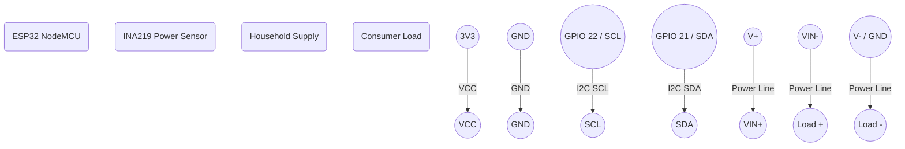

# Consumer Node (ESP32 + INA219) Wiring Diagram

### Notes
- The INA219 communicates via I2C (default pins 21/SDA and 22/SCL on ESP32).
- The `VIN+` and `VIN-` pins are connected in series with the high side of the load to measure current across the internal shunt resistor.
- The INA219 measures bus voltage internally from `VIN-` to GND.
