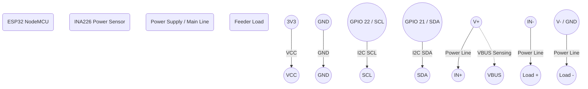

# Feeder Node (ESP32 + INA226) Wiring Diagram

### Notes
- The INA226 communicates via I2C (default pins 21/SDA and 22/SCL on ESP32).
- The `IN+` and `IN-` pins are connected in series with the high side of the load to measure current across the internal shunt resistor.
- The `VBUS` pin is connected to the load's positive supply to measure bus voltage.
