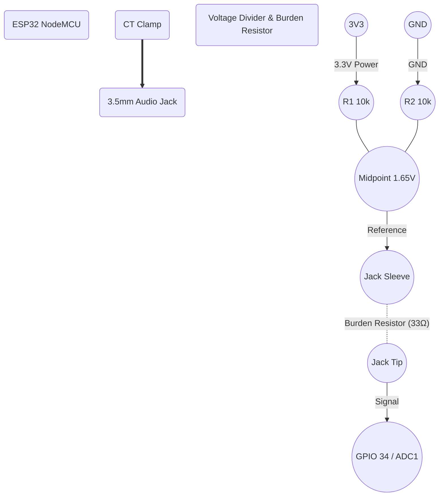

# Localization Node (ESP32 + CT Clamp) Wiring Diagram

### Notes
- The CT Clamp outputs an AC current which needs to be converted to an AC voltage using a Burden Resistor (if the CT doesn't have one built-in).
- A voltage divider (R1 and R2, typically 10kΩ each) creates a DC bias (midpoint) of 1.65V (half of 3.3V) so the AC signal oscillates between 0V and 3.3V, keeping it within the ESP32's ADC range.
- The analog signal is read by an ADC pin on the ESP32 (e.g., GPIO 34).
